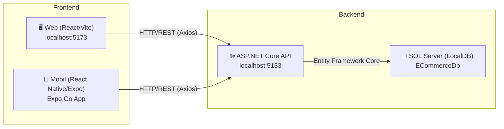

# 📁 Proje Klasör Yapısı ve Dosya Dokümantasyonu

Bu döküman, **Çok Satıcılı E-Ticaret Pazaryeri (Multi-Vendor B2B2C Marketplace)** projesinin tüm klasör ve dosya yapısını, kullanılan dilleri ve her dosyanın görevini detaylı şekilde açıklamaktadır.

---

## 🏗️ Genel Mimari Özeti

| Katman | Klasör | Dil / Teknoloji | Görev |
|---|---|---|---|
| **Veri Modelleri** | `ECommerce.Models` | C# (.NET 8) | Veritabanı tablolarını temsil eden sınıflar |
| **Veri Erişimi** | `ECommerce.Data` | C# (Entity Framework Core) | Veritabanı bağlantısı, migration'lar, repository |
| **İş Mantığı** | `ECommerce.Business` | C# | Servis katmanı (iş kuralları) |
| **Backend API** | `ECommerce.Web` | C# (ASP.NET Core Web API) | REST API sunucusu, Controller'lar, JWT kimlik doğrulama |
| **Web Arayüzü** | `ECommerce.FrontendWeb` | JavaScript (React + Vite) | Tarayıcıda çalışan web arayüzü (SPA) |
| **Mobil Uygulama** | `ECommerce.Mobile` | JavaScript (React Native + Expo) | iOS/Android mobil uygulama |

---

## 📂 Kök Dizin (`Mobil taabanlı proje/`)

| Dosya / Klasör | Tür | Dil | Açıklama |
|---|---|---|---|
| `ECommerce.sln` | Dosya | — | .NET Solution dosyası. Visual Studio bu dosyayı açarak tüm C# projelerini (Models, Data, Business, Web) bir arada yönetir. |
| `global.json` | Dosya | JSON | Hangi .NET SDK sürümünün kullanılacağını belirtir. |
| `Ortak_Backend_Degisiklikleri.md` | Dosya | Markdown | Projedeki önemli backend değişikliklerinin günlüğü (changelog). |
| `Proje İlerleme Raporu.md` | Dosya | Markdown | Proje ilerleme notları. |
| `BLM4538 PROJE RAPORU.docx` | Dosya | Word | Ders projesi raporu. |
| `.gitignore` | Dosya | — | Git'in takip etmemesi gereken dosya/klasörlerin listesi. |
| `.vs/` | Klasör | — | Visual Studio'nun kendi iç ayar dosyaları (otomatik oluşur). |

---

## 📦 `ECommerce.Models/` — Veri Modelleri

> **Dil:** C# &nbsp;|&nbsp; **Teknoloji:** .NET 8 Class Library
>
> Veritabanındaki tabloların karşılığı olan POCO (Plain Old CLR Object) sınıflarını barındırır. Tüm diğer projeler bu projeye referans verir.

| Dosya | Açıklama |
|---|---|
| [User.cs](file:///c:/Users/ASUS/Desktop/Mobil%20taabanl%c4%b1%20proje/ECommerce.Models/User.cs) | Kullanıcı modeli. `FullName`, `Email`, `Password`, `IsAdmin`, `IsSeller` gibi alanlar. Her kullanıcının opsiyonel olarak bir `Store` (Mağaza) ile 1-1 ilişkisi var. |
| [Product.cs](file:///c:/Users/ASUS/Desktop/Mobil%20taabanl%c4%b1%20proje/ECommerce.Models/Product.cs) | Ürün/Hizmet modeli. `Name`, `Price`, `Stock`, `ImageUrl`, `Keywords` (SEO etiketleri), `StoreId`, `StoreCategoryId`, `CategoryId` alanlarını içerir. |
| [Category.cs](file:///c:/Users/ASUS/Desktop/Mobil%20taabanl%c4%b1%20proje/ECommerce.Models/Category.cs) | Global (sistem geneli) kategori modeli. Tüm mağazalar için geçerli olan üst düzey kategoriler (Elektronik, Giyim vb.). |
| [Store.cs](file:///c:/Users/ASUS/Desktop/Mobil%20taabanl%c4%b1%20proje/ECommerce.Models/Store.cs) | Mağaza/Dükkan modeli. Satıcının vitrin bilgileri: `Name`, `Description`, `ProfileImageUrl`, `BannerImageUrl`. `SellerId` ile User'a bağlı. |
| [StoreCategory.cs](file:///c:/Users/ASUS/Desktop/Mobil%20taabanl%c4%b1%20proje/ECommerce.Models/StoreCategory.cs) | Mağazaya özel kategori modeli. Her satıcının kendi dükkanı içinde oluşturduğu alt kategoriler (ör: "2. El Parçalar", "Diyet Programı"). |
| [Cart.cs](file:///c:/Users/ASUS/Desktop/Mobil%20taabanl%c4%b1%20proje/ECommerce.Models/Cart.cs) | Alışveriş sepeti modeli. Her kullanıcının bir sepeti olur. |
| [CartItem.cs](file:///c:/Users/ASUS/Desktop/Mobil%20taabanl%c4%b1%20proje/ECommerce.Models/CartItem.cs) | Sepet kalemi. Hangi üründen kaç adet sepete eklendiğini tutar. |
| [Order.cs](file:///c:/Users/ASUS/Desktop/Mobil%20taabanl%c4%b1%20proje/ECommerce.Models/Order.cs) | Sipariş modeli. `OrderDate`, `TotalAmount`, `Status`, `ShippingAddress` gibi alanlar. |
| [OrderItem.cs](file:///c:/Users/ASUS/Desktop/Mobil%20taabanl%c4%b1%20proje/ECommerce.Models/OrderItem.cs) | Sipariş kalemi. Siparişteki her bir ürün satırını temsil eder. |
| `ViewModels/CheckoutViewModel.cs` | Ödeme sayfası için kullanılan view model. |

---

## 💾 `ECommerce.Data/` — Veri Erişim Katmanı

> **Dil:** C# &nbsp;|&nbsp; **Teknoloji:** Entity Framework Core (EF Core), SQL Server (LocalDB)
>
> Veritabanı bağlantısı, tablo yapılandırmaları ve migration dosyalarını içerir.

| Dosya / Klasör | Açıklama |
|---|---|
| [ApplicationDbContext.cs](file:///c:/Users/ASUS/Desktop/Mobil%20taabanl%c4%b1%20proje/ECommerce.Data/ApplicationDbContext.cs) | **Ana veritabanı bağlamı.** Tüm `DbSet<>` tanımları (Users, Products, Categories, Stores, StoreCategories, Carts, CartItems, Orders, OrderItems) ve ilişkisel kısıtlamalar (Foreign Key, Cascade Delete kuralları) burada yapılandırılır. |
| `ApplicationDbContextFactory.cs` | Design-time factory. `dotnet ef` komutlarının (migration oluşturma vb.) çalışması için gerekli. |
| `Repositories/IRepository.cs` | Generic repository arayüzü (interface). CRUD operasyonlarının sözleşmesi. |
| `Repositories/Repository.cs` | Generic repository implementasyonu. `IRepository`'yi EF Core ile gerçekleştirir. |
| `Migrations/` | EF Core migration dosyaları. Veritabanı şemasındaki her değişiklik burada kaydedilir (ör: `MultiVendorUpdate`). |

---

## ⚙️ `ECommerce.Business/` — İş Mantığı Katmanı

> **Dil:** C# &nbsp;|&nbsp; **Teknoloji:** .NET 8 Class Library
>
> Controller ile Data katmanı arasında köprü görevi gören servis sınıflarını barındırır.

| Dosya | Açıklama |
|---|---|
| `Services/ProductService.cs` | Ürün iş kuralları servisi. Repository üzerinden ürün CRUD işlemlerini yönetir. |

---

## 🌐 `ECommerce.Web/` — Backend API Sunucusu

> **Dil:** C# &nbsp;|&nbsp; **Teknoloji:** ASP.NET Core 8 Web API, JWT Bearer Authentication, Swagger
>
> Tüm frontend'lerin (Web ve Mobil) ortak kullandığı **REST API** sunucusu. `http://localhost:5133` üzerinde çalışır.

### Kök Dosyalar

| Dosya | Açıklama |
|---|---|
| [Program.cs](file:///c:/Users/ASUS/Desktop/Mobil%20taabanl%c4%b1%20proje/ECommerce.Web/Program.cs) | **Uygulamanın giriş noktası.** Burada servislerin kaydı (DI), JWT kimlik doğrulama ayarları, CORS politikası, Swagger konfigürasyonu ve middleware pipeline sıralaması (Authentication → Authorization → Controllers) yapılır. |
| [appsettings.json](file:///c:/Users/ASUS/Desktop/Mobil%20taabanl%c4%b1%20proje/ECommerce.Web/appsettings.json) | Uygulama yapılandırması. Veritabanı bağlantı dizesi (`ConnectionStrings`) ve JWT şifreleme anahtarı (`Jwt:Key`) burada tanımlıdır. |
| `appsettings.Development.json` | Geliştirme ortamına özel log ayarları. |
| `Helpers/AuthHelper.cs` | JWT token'dan kullanıcı ID'si çıkarmak gibi yardımcı metotlar. |
| `Models/ErrorViewModel.cs` | Hata sayfaları için basit view model. |
| `Properties/launchSettings.json` | `dotnet run` komutunun hangi port ve IP'leri dinleyeceğini belirler. Şu anda `localhost:5133` ve `172.20.10.2:5133` dinliyor. |

---

### 🎮 Controllers — API Uç Noktaları (Detaylı)

> Bu bölüm, projenin tüm API endpoint'lerinin ne yaptığını ayrıntılı olarak açıklar.
> Her controller dosyası C# ile yazılmıştır ve `api/[ControllerAdı]` rotası üzerinden HTTP istekleri alır.

---

#### 🔐 [AccountApiController.cs](file:///c:/Users/ASUS/Desktop/Mobil%20taabanl%c4%b1%20proje/ECommerce.Web/Controllers/AccountApiController.cs)
**Rota:** `api/AccountApi` &nbsp;|&nbsp; **Görev:** Kullanıcı Kimlik Doğrulama ve Yönetimi

| HTTP | Yol | Yetki | Ne Yapar? |
|---|---|---|---|
| `POST` | `/register` | Herkese Açık | Yeni kullanıcı kaydı oluşturur. `IsSeller: true` gönderilirse otomatik olarak bir `Store` (boş mağaza) da oluşturur. Şifreyi SHA256 ile hashleyerek veritabanına kaydeder. |
| `POST` | `/login` | Herkese Açık | E-posta ve şifre ile giriş yapar. Başarılıysa JWT token döner. Token içinde `IsAdmin` ve `IsSeller` claim'leri bulunur. |
| `GET` | `/profile` | 🔒 Giriş Gerekli | JWT token'daki kullanıcının profil bilgilerini döner. |
| `PUT` | `/profile` | 🔒 Giriş Gerekli | Kullanıcının profil bilgilerini (ad, telefon, adres vb.) günceller. |

---

#### 🏪 [StoresApiController.cs](file:///c:/Users/ASUS/Desktop/Mobil%20taabanl%c4%b1%20proje/ECommerce.Web/Controllers/StoresApiController.cs)
**Rota:** `api/StoresApi` &nbsp;|&nbsp; **Görev:** Mağaza Yönetimi (Multi-Vendor)

| HTTP | Yol | Yetki | Ne Yapar? |
|---|---|---|---|
| `GET` | `/` | Herkese Açık | Tüm aktif mağazaların listesini döner. |
| `GET` | `/{id}` | Herkese Açık | Belirli bir mağazanın vitrin bilgilerini (ad, açıklama, banner, logo, kategoriler) döner. `Storefront.jsx` bu endpoint'i kullanır. |
| `GET` | `/MyStore` | 🔒 Satıcı | Giriş yapan satıcının kendi mağaza bilgisini döner. |
| `POST` | `/CreateMyStore` | 🔒 Giriş Gerekli | Yeni bir mağaza oluşturur (Satıcı yoksa).  |
| `PUT` | `/MyStore` | 🔒 Satıcı | Satıcının kendi mağaza bilgilerini (ad, açıklama, banner URL vb.) güncellemesini sağlar. |

---

#### 🏷️ [StoreCategoriesApiController.cs](file:///c:/Users/ASUS/Desktop/Mobil%20taabanl%c4%b1%20proje/ECommerce.Web/Controllers/StoreCategoriesApiController.cs)
**Rota:** `api/StoreCategoriesApi` &nbsp;|&nbsp; **Görev:** Mağazaya Özel Kategori Yönetimi

| HTTP | Yol | Yetki | Ne Yapar? |
|---|---|---|---|
| `GET` | `/MyCategories` | 🔒 Satıcı | Satıcının kendi dükkanına ait özel kategorileri listeler. |
| `POST` | `/MyCategories` | 🔒 Satıcı | Yeni bir özel kategori oluşturur (ör: "Gaming Laptop", "Pilates Dersi"). |
| `DELETE` | `/MyCategories/{id}` | 🔒 Satıcı | Bir özel kategoriyi siler. |

---

#### 📦 [ProductsApiController.cs](file:///c:/Users/ASUS/Desktop/Mobil%20taabanl%c4%b1%20proje/ECommerce.Web/Controllers/ProductsApiController.cs)
**Rota:** `api/ProductsApi` &nbsp;|&nbsp; **Görev:** Ürün/Hizmet CRUD ve Arama

| HTTP | Yol | Yetki | Ne Yapar? |
|---|---|---|---|
| `GET` | `/` | Herkese Açık | Tüm ürünleri listeler. `?storeId=X` parametresi ile belirli bir mağazaya ait ürünleri filtreleyebilir. |
| `GET` | `/{id}` | Herkese Açık | Tek bir ürünün detayını döner. |
| `GET` | `/search?searchTerm=X` | Herkese Açık | Ürün adı, açıklaması ve `Keywords` (SEO etiketleri) alanlarında arama yapar. |
| `GET` | `/category/{categoryId}` | Herkese Açık | Belirli bir global kategoriye ait ürünleri listeler. |
| `POST` | `/` | 🔒 Satıcı | Yeni ürün/hizmet ekler. Ürün otomatik olarak satıcının mağazasına (`StoreId`) bağlanır. |
| `PUT` | `/{id}` | 🔒 Satıcı (Kendi Ürünü) | Satıcı **yalnızca kendi** ürününü güncelleyebilir. Başka bir satıcının ürününe erişim `403 Forbidden` döner. |
| `DELETE` | `/{id}` | 🔒 Satıcı (Kendi Ürünü) | Satıcı **yalnızca kendi** ürününü silebilir. |

---

#### 📂 [CategoriesApiController.cs](file:///c:/Users/ASUS/Desktop/Mobil%20taabanl%c4%b1%20proje/ECommerce.Web/Controllers/CategoriesApiController.cs)
**Rota:** `api/CategoriesApi` &nbsp;|&nbsp; **Görev:** Global Kategori Yönetimi (Sistem Geneli)

| HTTP | Yol | Yetki | Ne Yapar? |
|---|---|---|---|
| `GET` | `/` | Herkese Açık | Tüm global kategorileri listeler (Elektronik, Giyim, Kitap vb.). |
| `POST` | `/` | 🔒 Admin | Yeni global kategori ekler. |
| `PUT` | `/{id}` | 🔒 Admin | Global kategori günceller. |
| `DELETE` | `/{id}` | 🔒 Admin | Global kategori siler. |

---

#### 🛒 [CartApiController.cs](file:///c:/Users/ASUS/Desktop/Mobil%20taabanl%c4%b1%20proje/ECommerce.Web/Controllers/CartApiController.cs)
**Rota:** `api/CartApi` &nbsp;|&nbsp; **Görev:** Alışveriş Sepeti İşlemleri

| HTTP | Yol | Yetki | Ne Yapar? |
|---|---|---|---|
| `GET` | `/` | 🔒 Giriş Gerekli | Kullanıcının mevcut sepetini ve ürünleri döner. |
| `POST` | `/add` | 🔒 Giriş Gerekli | Sepete ürün ekler veya miktarını artırır. |
| `PUT` | `/update` | 🔒 Giriş Gerekli | Sepetteki bir ürünün miktarını günceller. |
| `DELETE` | `/remove/{productId}` | 🔒 Giriş Gerekli | Sepetten belirli bir ürünü çıkarır. |
| `DELETE` | `/clear` | 🔒 Giriş Gerekli | Sepeti tamamen boşaltır. |

---

#### 📋 [OrderApiController.cs](file:///c:/Users/ASUS/Desktop/Mobil%20taabanl%c4%b1%20proje/ECommerce.Web/Controllers/OrderApiController.cs)
**Rota:** `api/OrderApi` &nbsp;|&nbsp; **Görev:** Sipariş Oluşturma ve Takip

| HTTP | Yol | Yetki | Ne Yapar? |
|---|---|---|---|
| `GET` | `/` | 🔒 Giriş Gerekli | Kullanıcının geçmiş siparişlerini listeler. |
| `GET` | `/{id}` | 🔒 Giriş Gerekli | Belirli bir siparişin detayını döner. |
| `POST` | `/` | 🔒 Giriş Gerekli | Sepetten sipariş oluşturur. Stok kontrolü yapar; yeterli stok yoksa hata döner. Başarılıysa stokları düşer ve sepeti boşaltır. |

---

## 🖥️ `ECommerce.FrontendWeb/` — Web Arayüzü (Detaylı)

> **Dil:** JavaScript (JSX) &nbsp;|&nbsp; **Teknoloji:** React 19, Vite 8, React Router, Axios
>
> Tarayıcıda çalışan tek sayfalık uygulama (SPA). `http://localhost:5173` üzerinde sunulur.
> Siyah-Beyaz-Turkuaz renk paleti, Nunito fontu kullanır.

### Kök Dosyalar

| Dosya | Dil | Açıklama |
|---|---|---|
| `package.json` | JSON | Projenin bağımlılıkları (react, axios, jwt-decode, react-router-dom) ve script'leri (`npm run dev`). |
| `vite.config.js` | JavaScript | Vite build aracının yapılandırması. |
| `index.html` | HTML | Uygulamanın tek HTML dosyası. React tüm arayüzü bu dosyanın `<div id="root">` elemanına yerleştirir. |
| `eslint.config.js` | JavaScript | Kod kalite kontrol (linting) ayarları. |

### `src/` — Kaynak Kod

| Dosya | Dil | Açıklama |
|---|---|---|
| [main.jsx](file:///c:/Users/ASUS/Desktop/Mobil%20taabanl%c4%b1%20proje/ECommerce.FrontendWeb/src/main.jsx) | JSX | **Uygulamanın giriş noktası.** React DOM'u oluşturur, `AuthProvider` ve `CartProvider` ile sarmalayarak global state'i sağlar, `BrowserRouter`'ı başlatır. |
| [App.jsx](file:///c:/Users/ASUS/Desktop/Mobil%20taabanl%c4%b1%20proje/ECommerce.FrontendWeb/src/App.jsx) | JSX | **Rota yapılandırması.** Tüm sayfa rotalarını (`/`, `/login`, `/register`, `/cart`, `/orders`, `/store/:id`, `/seller-dashboard`, `/admin`) tanımlar. `ProtectedRoute`, `ProtectedSellerRoute`, `ProtectedAdminRoute` ile yetkilendirme kontrolleri yapar. |
| [index.css](file:///c:/Users/ASUS/Desktop/Mobil%20taabanl%c4%b1%20proje/ECommerce.FrontendWeb/src/index.css) | CSS | **Global tasarım sistemi.** CSS değişkenleri (renk paleti, gölgeler), grid sistemi, buton stilleri, ürün kartları, form elemanları, animasyonlar (`fade-up`, `fade-in`, `slide-down`) ve responsive düzen kuralları. |
| `App.css` | CSS | Ek stil tanımları. |

### `src/context/` — Global State Yönetimi

| Dosya | Açıklama |
|---|---|
| [AuthContext.jsx](file:///c:/Users/ASUS/Desktop/Mobil%20taabanl%c4%b1%20proje/ECommerce.FrontendWeb/src/context/AuthContext.jsx) | **Kimlik doğrulama durumu.** JWT token'ı `localStorage`'da saklar, `jwtDecode` ile çözerek `user`, `isAdmin`, `isSeller` bilgilerini tüm bileşenlere sunar. `login()`, `register()` ve `logout()` fonksiyonlarını sağlar. Axios'a default `Authorization` header'ı ekler. |
| [CartContext.jsx](file:///c:/Users/ASUS/Desktop/Mobil%20taabanl%c4%b1%20proje/ECommerce.FrontendWeb/src/context/CartContext.jsx) | **Sepet durumu.** Sepet verilerini API'den çeker, `addToCart()`, `updateQuantity()`, `removeItem()` fonksiyonlarını sunar. Navbar'daki sepet badge'i bu context'ten beslenir. |

### `src/components/` — Paylaşılan Bileşenler

| Dosya | Açıklama |
|---|---|
| [Navbar.jsx](file:///c:/Users/ASUS/Desktop/Mobil%20taabanl%c4%b1%20proje/ECommerce.FrontendWeb/src/components/Navbar.jsx) | **Üst navigasyon çubuğu.** Logo, kategori linkleri, global arama çubuğu (büyüteç ikonu ile açılır), sepet ikonu (badge ile ürün sayısı), sipariş ve profil ikonları. Satıcı/Admin için açılır "YÖNETİM" menüsü. Sticky pozisyonda sayfa kaydırılınca sabit kalır. |

### `src/pages/` — Sayfa Bileşenleri

| Dosya | Erişim | Açıklama |
|---|---|---|
| [Home.jsx](file:///c:/Users/ASUS/Desktop/Mobil%20taabanl%c4%b1%20proje/ECommerce.FrontendWeb/src/pages/Home.jsx) | Herkese Açık | **Ana sayfa.** Hero bölümü ("YENİ SEZON" başlığı), kategori filtre butonları, ürün grid'i. URL'den `?search=X` parametresi alarak arama sonuçlarını, `?cat=X` ile kategori filtresini gösterir. Her ürün kartında mağaza adı, fiyat ve "Sepete Ekle" butonu bulunur. |
| [Login.jsx](file:///c:/Users/ASUS/Desktop/Mobil%20taabanl%c4%b1%20proje/ECommerce.FrontendWeb/src/pages/Login.jsx) | Herkese Açık | **Giriş sayfası.** E-posta ve şifre alanları.  Alttaki "Hesabınız yok mu? Üye Olun" linki Register sayfasına yönlendirir. |
| [Register.jsx](file:///c:/Users/ASUS/Desktop/Mobil%20taabanl%c4%b1%20proje/ECommerce.FrontendWeb/src/pages/Register.jsx) | Herkese Açık | **Kayıt sayfası.** Ad Soyad, E-Posta, Şifre, Şifre Onay alanları ve **"Satıcı Hesabı"** checkbox'ı. İşaretlenirse `isSeller: true` olarak kayıt olunur ve otomatik mağaza açılır. |
| [Cart.jsx](file:///c:/Users/ASUS/Desktop/Mobil%20taabanl%c4%b1%20proje/ECommerce.FrontendWeb/src/pages/Cart.jsx) | Giriş Gerekli | **Sepet sayfası.** Sepetteki ürünlerin listesi, miktar artırma/azaltma, ürün çıkarma, toplam tutar hesabı ve "Sipariş Ver" butonu. |
| [Orders.jsx](file:///c:/Users/ASUS/Desktop/Mobil%20taabanl%c4%b1%20proje/ECommerce.FrontendWeb/src/pages/Orders.jsx) | Giriş Gerekli | **Sipariş geçmişi.** Geçmiş siparişlerin listesi, her siparişin detayına tıklayarak genişletme. |
| [Storefront.jsx](file:///c:/Users/ASUS/Desktop/Mobil%20taabanl%c4%b1%20proje/ECommerce.FrontendWeb/src/pages/Storefront.jsx) | Herkese Açık | **Mağaza vitrini.** YouTube kanal sayfası gibi: üstte büyük banner, solda yuvarlak profil logosu, mağaza açıklaması, satıcının özel kategorileri ile filtreleme butonları ve sadece o mağazaya ait ürün grid'i. `/store/:id` rotasından erişilir. |
| [SellerDashboard.jsx](file:///c:/Users/ASUS/Desktop/Mobil%20taabanl%c4%b1%20proje/ECommerce.FrontendWeb/src/pages/SellerDashboard.jsx) | 🔒 Satıcı | **Satıcı yönetim paneli.** 3 sekmeli: (1) Mağaza Ayarları (ad, açıklama, profil/banner fotoğrafı URL), (2) Özel Kategoriler (oluştur/sil), (3) Ürün/Hizmet Yönetimi (ekle/düzenle/sil — Keywords/SEO etiketleri, global kategori ve özel kategori seçimi). |
| [AdminDashboard.jsx](file:///c:/Users/ASUS/Desktop/Mobil%20taabanl%c4%b1%20proje/ECommerce.FrontendWeb/src/pages/AdminDashboard.jsx) | 🔒 Super Admin | **Süper admin paneli.** Tüm mağazaların ve ürünlerin yönetimi, global kategori ekleme/silme. |

---

## 📱 `ECommerce.Mobile/` — Mobil Uygulama (Detaylı)

> **Dil:** JavaScript (JSX) &nbsp;|&nbsp; **Teknoloji:** React Native 0.81, Expo 54, React Navigation (Bottom Tabs)
>
> iOS ve Android'de çalışan native mobil uygulama. `expo start` komutuyla başlatılır.
> Siyah-Beyaz-Turkuaz renk paleti (Web ile uyumlu).

### Kök Dosyalar

| Dosya | Dil | Açıklama |
|---|---|---|
| `package.json` | JSON | Bağımlılıklar: `expo`, `react-native`, `@react-navigation/bottom-tabs`, `axios`, `jwt-decode`, `@react-native-async-storage/async-storage`. |
| `app.json` | JSON | Expo uygulama yapılandırması (uygulama adı, ikon, splash screen vb.). |
| [App.js](file:///c:/Users/ASUS/Desktop/Mobil%20taabanl%c4%b1%20proje/ECommerce.Mobile/App.js) | JavaScript | **Uygulamanın giriş noktası.** `AuthProvider` ile sarmalayıp `AppNavigator`'ı render eder. |
| `index.js` | JavaScript | Expo/React Native'in uygulama kayıt noktası. `registerRootComponent(App)` çağrısını yapar. |

### `src/theme/` — Tasarım Sistemi

| Dosya | Açıklama |
|---|---|
| [colors.js](file:///c:/Users/ASUS/Desktop/Mobil%20taabanl%c4%b1%20proje/ECommerce.Mobile/src/theme/colors.js) | **Renk paleti tanımları.** `primary` (siyah `#0D0D0D`), `accent` (turkuaz `#2DD4BF`), `accentDark` (`#14B8A6`), `background` (açık gri), `surface` (beyaz), `danger` (kırmızı), `success` (yeşil), `border`, `text`, `textMuted`. Tüm ekranlar bu değişkenleri referans alır. |

### `src/navigation/` — Navigasyon Yapısı

| Dosya | Açıklama |
|---|---|
| [AppNavigator.js](file:///c:/Users/ASUS/Desktop/Mobil%20taabanl%c4%b1%20proje/ECommerce.Mobile/src/navigation/AppNavigator.js) | **Ana navigasyon yöneticisi.** `AuthContext`'ten `isAuthenticated` durumuna göre iki farklı navigasyon gösterir: Giriş yapmamış kullanıcılar `GuestTabs`'ı (Vitrin + Giriş Yap), giriş yapmış kullanıcılar `AuthenticatedTabs`'ı (Vitrin + Sepet + Siparişlerim + Hesabım) görür. `Register` ekranı alt bardan gizli ama `Login`'den erişilebilir. |

### `src/context/` — Global State Yönetimi

| Dosya | Açıklama |
|---|---|
| [AuthContext.js](file:///c:/Users/ASUS/Desktop/Mobil%20taabanl%c4%b1%20proje/ECommerce.Mobile/src/context/AuthContext.js) | **Mobil kimlik doğrulama.** Web'deki `AuthContext.jsx`'in mobil karşılığı. Token'ı `AsyncStorage`'da saklar (localStorage yerine). JWT'den `isAdmin` ve `isSeller` bilgilerini çıkarır. Axios'a `baseURL` olarak bilgisayarın yerel IP'sini (`172.20.10.2:5133`) ve `Authorization` header'ını ayarlar. `login()`, `register()` ve `logout()` fonksiyonlarını sağlar. 10 saniyelik timeout tanımlıdır. |

### `src/screens/` — Ekranlar

| Dosya | Erişim | Açıklama |
|---|---|---|
| [LoginScreen.js](file:///c:/Users/ASUS/Desktop/Mobil%20taabanl%c4%b1%20proje/ECommerce.Mobile/src/screens/LoginScreen.js) | Herkese Açık | **Giriş ekranı.** Koyu siyah arka plan, beyaz yuvarlak kart, turkuaz "Giriş Yap" butonu. E-Posta ve Şifre alanları. Altta "Hesabınız yok mu? Kayıt Ol" linki. |
| [RegisterScreen.js](file:///c:/Users/ASUS/Desktop/Mobil%20taabanl%c4%b1%20proje/ECommerce.Mobile/src/screens/RegisterScreen.js) | Herkese Açık | **Kayıt ekranı.** LoginScreen ile aynı görsel dil (siyah arkaplan, beyaz kart). Ad Soyad, E-Posta, Şifre, Şifre Tekrar alanları. **"Satıcı Hesabı"** checkbox'ı ile mağaza açma seçeneği. Turkuaz "KAYDOL" butonu. |
| [HomeScreen.js](file:///c:/Users/ASUS/Desktop/Mobil%20taabanl%c4%b1%20proje/ECommerce.Mobile/src/screens/HomeScreen.js) | Herkese Açık | **Ana sayfa / Vitrin.** API'den ürünlerin ve kategorilerin çekilmesi. Yatay kaydırılabilir kategori filtre butonları. Dikey ürün listesi (FlatList), her üründe görsel, ad, fiyat ve "Sepete Ekle" butonu. |
| [CartScreen.js](file:///c:/Users/ASUS/Desktop/Mobil%20taabanl%c4%b1%20proje/ECommerce.Mobile/src/screens/CartScreen.js) | 🔒 Giriş Gerekli | **Sepet ekranı.** Sepetteki ürün listesi, miktar güncelleme (+/- butonları), ürün silme, toplam tutar ve "Sipariş Ver" butonu. |
| [OrdersScreen.js](file:///c:/Users/ASUS/Desktop/Mobil%20taabanl%c4%b1%20proje/ECommerce.Mobile/src/screens/OrdersScreen.js) | 🔒 Giriş Gerekli | **Sipariş geçmişi.** Geçmiş siparişlerin listesi, dokunarak genişletip sipariş detaylarını görme. |
| [ProfileScreen.js](file:///c:/Users/ASUS/Desktop/Mobil%20taabanl%c4%b1%20proje/ECommerce.Mobile/src/screens/ProfileScreen.js) | 🔒 Giriş Gerekli | **Profil/Hesap ekranı.** Kullanıcı bilgileri ve "Çıkış Yap" butonu. |

---

## 🔄 Veri Akışı Diyagramı



---

## 🚀 Projeyi Çalıştırma

### 1. Backend API'yi Başlat
```bash
cd ECommerce.Web
dotnet run
```
> API `http://localhost:5133` üzerinde ayağa kalkar. Swagger arayüzü de aynı adreste açılır.

### 2. Web Arayüzünü Başlat
```bash
cd ECommerce.FrontendWeb
npm install   # (ilk sefer)
npm run dev
```
> Vite geliştirme sunucusu `http://localhost:5173` üzerinde başlar.

### 3. Mobil Uygulamayı Başlat
```bash
cd ECommerce.Mobile
npm install   # (ilk sefer)
npx expo start
```
> Expo CLI başlar, QR kodu tarayarak telefondan erişebilirsiniz.

> [!IMPORTANT]
> Telefondan erişim için `ECommerce.Mobile/src/context/AuthContext.js` içindeki `API_IP` değişkenini bilgisayarınızın Wi-Fi IP adresine güncelleyin ve Windows Firewall'da 5133 portuna izin verin.
